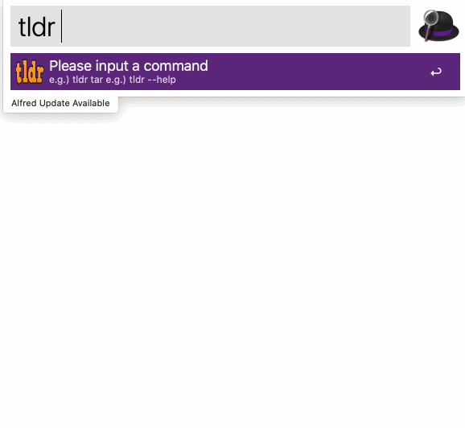

## alfred tldr
[tldr](https://github.com/tldr-pages/tldr) alfred workflow written in go.

## Install
- Download and open the workflow with terminal on macOS.
```
$ curl https://raw.githubusercontent.com/konoui/alfred-tldr/m1-workflow/install.sh | bash -
```

- Build the workflow on your computer.
```
$ make package
$ ls
tldr.alfredworkflow (snip)
```

## Usage
`tldr <query>`

Options   
`--version`/`-v` option shows the current version of the client.   
`--update`/`-u` option updates local database (tldr repository).  
`--platform`/`-p` option selects platform from `linux`,`osx`,`sunos`,`windows`.  
`--language`/`-L` option selects preferred language for the page.


## License
MIT License.
